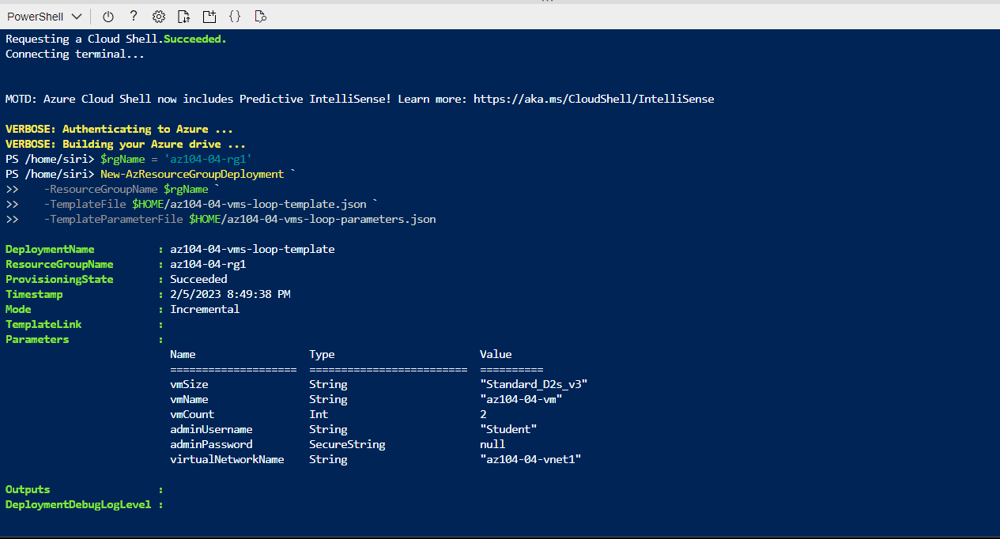

# Objectives
In this lab, you will:

    Task 1: Create and configure a virtual network
    Task 2: Deploy virtual machines into the virtual network
    Task 3: Configure private and public IP addresses of Azure VMs
    Task 4: Configure network security groups
    Task 5: Configure Azure DNS for internal name resolution
    Task 6: Configure Azure DNS for external name resolution

# Network Map

# Task 1: Create and configure a virtual network with two subnets

Create a resource group
-

Create a virtual network
-

Create two subnets
-

    -ipadd space 10.40.0.0/20
    -subnet0 10.40.0.0/24
    -subnet1 10.40.1.0/24

Create Virtual machine in both subnets using ARM
-

-Upload the templates

# TASK 2: Deploy two virtual machines using the template and paramenter files on powershell

    $rgName = 'az104-04-rg1'

    New-AzResourceGroupDeployment `
        -ResourceGroupName $rgName `
        -TemplateFile $HOME/az104-04-vms-loop-template.json `
        -TemplateParameterFile $HOME/az104-04-vms-loop-parameters.json

-Verify the vm were created

# TASK 3: Configure private and public IP addresses of Azure VMs

# TASK 4: Configure network security groups  
-In order to allow for restricted connectivity to Azure virtual machines.

-From the error above create a network SG and then an inbound security rules to allow RDP

-Associate the NGS to the nics

Start both VMs
download the RDP

VM0

VM1

# TASK 5: Configure Azure DNS for internal name resolution

In this task, you will configure DNS name resolution within a virtual network by using Azure private DNS zones.

-Create Private DNS zones for internal name resolution

Link

Connect to the RDP session

Note: I found the pasword within the ARM template

    Student
    Pa55w.rd1234

Verify DNS resolution is woking

# Task 6: configure Azure DNS for external name resolution

VM public iP

    az104-04-vm0 20.172.148.64
    az104-04-vm1 20.51.160.144

Verify that the output of the command includes the public IP address of az104-04-vm1.

# Completion map

# Clean up

-List all resource groups created

    Get-AzResourceGroup -Name 'az104-04*'

-Delete all resource groups created by this lab

    Get-AzResourceGroup -Name 'az104-04*' | Remove-AzResourceGroup -Force -AsJob

-resource before clean up

-After Clean up

